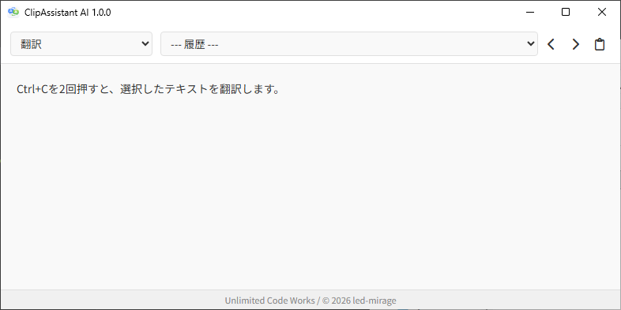

#  ClipAssistant AI

© 2026 led-mirage

## 💎 概要

`ClipAssistant AI` は、クリップボード内のテキストを AI が即座に加工・処理し、あなたのワークフローを加速させるデスクトップツールです。

「コピー」という日常的な動作からシームレスに AI を呼び出せるため、作業の流れを止めることなくメインタスクに集中できます。動作モードを切り替えることで、翻訳、要約、校正、コード解説など、あらゆるシーンで最適なアシスタントへと姿を変えます。

## 📷 スクリーンショット

任意の場所でテキストを選択して **Ctrl+C** を2回押すと、クリップボードの内容をAIが即座に処理し、結果を表示します。

## 🚀 特徴

- **ダブルコピー・トリガー:** Ctrl + C を素早く2回押すだけで、クリップボードのテキストをAIが処理。
- **マルチ LLM 対応:** OpenAI、Anthropic Claude、Google Gemini といった主要な AI サービスに対応。
- **マルチモード対応:** 翻訳、要約、コード校正など、用途に合わせたプロンプト（モード）を瞬時に切り替え可能。
- **自由自在なカスタマイズ:** `config.yaml` を編集するだけで、あなただけのオリジナルモードを簡単に追加できます。「関西弁で要約」「コードのバグチェック」など、アイデア次第で可能性は無限大です。
- **常駐型デザイン:** システムトレイに常駐し、作業を邪魔しません。

## 📦 インストールとアンインストール

### APIキーの登録

ご利用の際には、対応している AI サービスの **APIキー** を、Windowsの環境変数に登録しておく必要があります。

設定方法については[こちらの資料](README_CONFIG.md#-apiキーの登録)をご参照ください。

### インストール

アプリをインストールするには、以下のリンクから最新版の ZIP を取得して、お好みの場所に展開してください。  
<https://github.com/led-mirage/ClipAssistant/releases>

### アンインストール

アンインストールは、展開したフォルダごと削除するだけで完了します。  
※ 登録した環境変数が不要な場合は、手動で削除してください。

## 🛠️ 使い方

1. **アプリの起動** `ClipAssistant.exe` を実行すると、システムトレイに常駐します。
2. **AIで処理する** ブラウザやエディタ上でテキストを選択し、**Ctrl + C を素早く2回** 押します。
3. **結果の確認** 自動的にウィンドウが最前面に表示され、AIによる生成結果が表示されます。
4. **モードの切り替え** ウィンドウ上部のドロップダウンメニューから、用途に合わせてモード（翻訳、要約など）を変更できます。
5. **履歴の参照** 左右の矢印ボタン（◀/▶）またはドロップダウンから、過去100件までの履歴をさかのぼることができます。

## ⚙️ 設定ガイド (`config.yaml`)

`config.yaml` を編集することで、使用するAIモデルや動作を自分好みに変更できます。

詳しくは[こちらの資料](README_CONFIG.md#️-設定ガイド-configyaml)をご参照ください。

## ⌨️ 開発者の方へ

開発者向けの資料（開発環境構築、ビルド方法など）は[こちら](./README_DEV.md)を参照してください。

## 🖥️ 動作環境

- OS: Windows 11
- Python: 3.10 以上 (ソースコードから実行する場合)
- APIキー: 以下のいずれか
    - OpenAI API Key
    - Anthropic Claude API Key
    - Google Gemini API Key
    - Azure OpenAI Service API Key

### ⚠️ セキュリティソフトの検知について

本アプリは個人開発のため、デジタル署名を行っていません。
そのため、ウイルス対策ソフトによっては誤検知される場合がありますが、ウイルスではありません。
ソースコードは全て公開されていますので、EXE版の利用に不安がある方は、Python環境を構築してソースコードから実行することを推奨します。

検査結果（VirusTotal）:
<https://www.virustotal.com/gui/file/84a5ee7d7106659452f7e7d0975702446414a8d31d0d87be43adf37d4c3dd3a8/detection>

## 📕 使用しているライブラリ

### 🔖 openai 2.15.0

テキスト生成のために使用  
ライセンス：Apache License 2.0  
https://github.com/openai/openai-python  

### 🔖 anthropic 0.76.0

テキスト生成のために使用  
ライセンス：MIT License  
https://github.com/anthropics/anthropic-sdk-python

### 🔖 google-genai 1.60.0

テキスト生成のために使用  
ライセンス：Apache License 2.0  
https://github.com/googleapis/python-genai

### 🔖 prynput 1.8.1

Ctrl+Cを検出するために使用  
ライセンス：LGPL-3.0 license  
https://github.com/moses-palmer/pynput  

### 🔖 pyperclip 1.11.0

クリップボードからテキストを取得するために使用  
ライセンス：BSD-3-Clause license  
https://github.com/asweigart/pyperclip

### 🔖 pyyaml 6.0.3

設定ファイルの読み書きに使用  
ライセンス：MIT License  
https://github.com/yaml/pyyaml  

### 🔖 pillow 12.1.0

アイコン画像の処理に使用  
ライセンス：MIT-CMU License  
https://github.com/python-pillow/Pillow

### 🔖 pystray 0.19.5

タスクトレイの処理に使用  
ライセンス： LGPL-3.0 license  
https://github.com/moses-palmer/pystray

### 🔖 pywebview 5.4

GUIの構築に使用  
ライセンス： BSD-3-Clause license  
https://github.com/r0x0r/pywebview

## ❗ 免責事項

- このソフトの利用によって生じた損害について、作者は責任を負いません
- 可能な範囲で安定動作を目指していますが、完全な動作保証はできません
- 自己の判断と責任で使ってください

## 📄 ライセンス

本プロジェクトは MIT License の下で公開されています。
詳しくは [LICENSE](./LICENSE) を参照してください。

© 2026 led-mirage

## 🏷️ リリース履歴

### v1.1.0 (2026/02/02)
- Markdownレンダリングに対応
- コードブロックのシンタックスハイライト機能を追加

### v1.0.0 (2026/02/01)
- ファーストリリース
